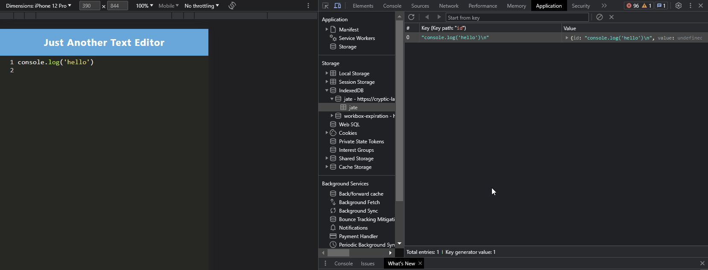

# text-editor

The text editor is used to save text entered with or without an internet connection.

## Technologies Used

- HTML
- CSS
- Javascript
- Workbox
- Service Workers
- IndexedDB

## Description

This text editor uses IndexedDB database to store and retrieve text entered by the user. It can work with or without internet. 

## Visual

## Usage

- To install all dev dependencies for both the client and server folder, run "npm install" in the terminal.
- To build the dist folder, run "npm run build" in the terminal.
- To start the server, run "npm run start" in the terminal.

## Deployed Application Link

https://cryptic-lake-08316-722d7609fd3f.herokuapp.com/ 

## Author & Contributors

- https://github.com/adorahtho 
- edX Boot Camps